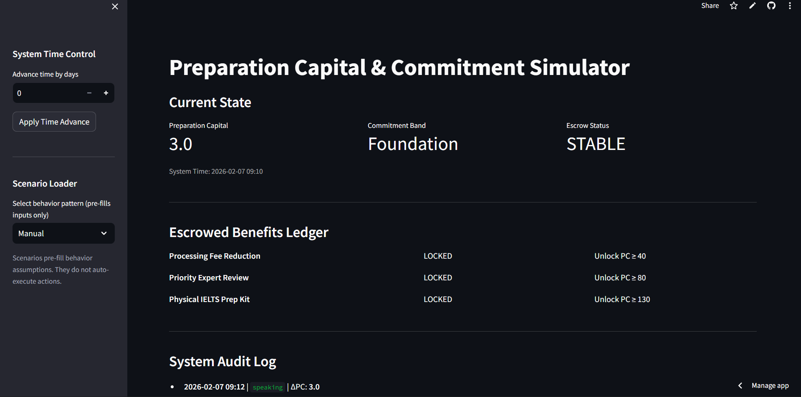
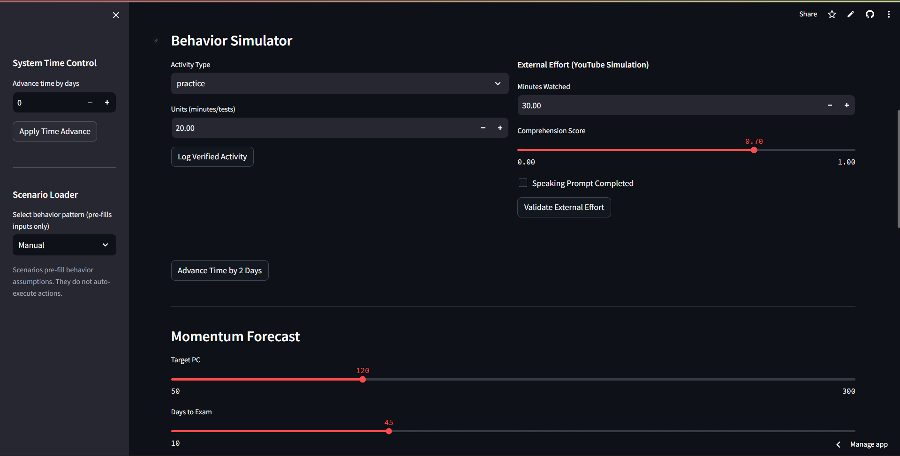
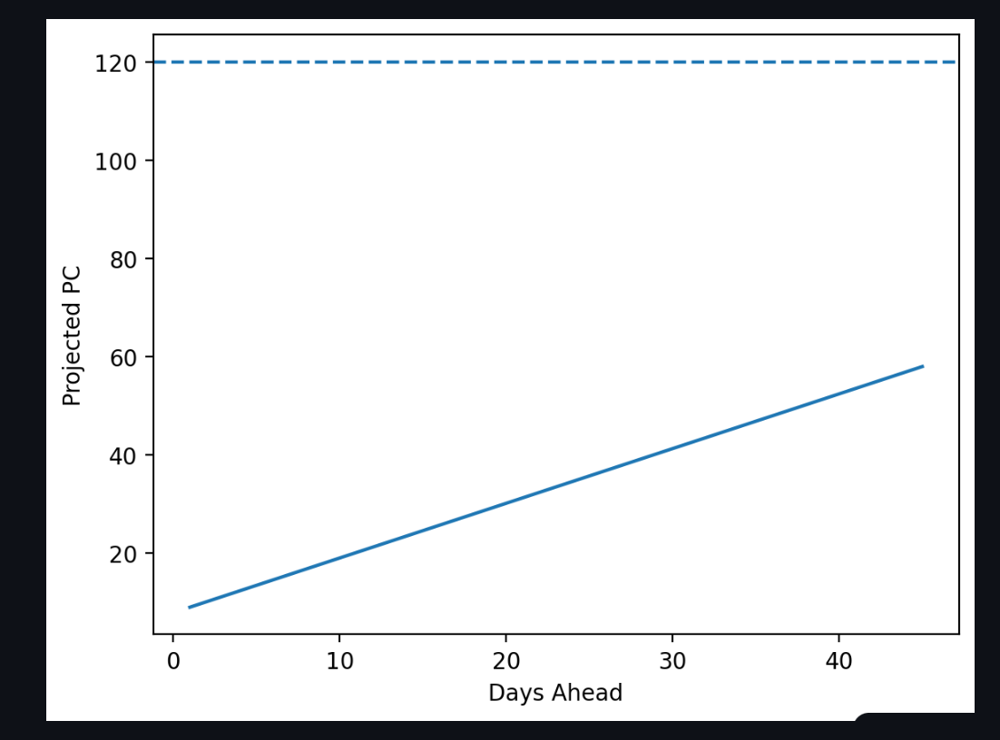
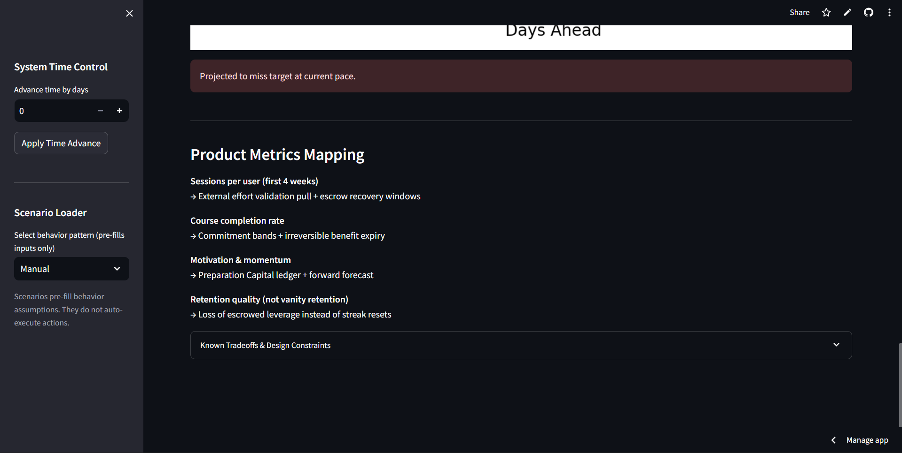

# Preparation Capital & Commitment Simulator

### Behavioral Engagement Prototype for IELTS Preparation

------------------------------------------------------------------------

## 1. Overview

This repository contains a **behavioral system simulator** designed to
model long-cycle engagement for IELTS preparation.

The prototype demonstrates how preparation effort can be:

-   Measured as **Preparation Capital (PC)**
-   Converted into **escrowed real-world leverage**
-   Protected through **commitment bands**
-   Exposed to **time-bound decay and recovery**
-   Forecasted toward **success or failure before exam date**

The goal is not UI polish or production readiness.\
The goal is **system validity, behavioral realism, and product reasoning
clarity**.

------------------------------------------------------------------------

## 2. Problem Context

Long-cycle exam preparation suffers from:

-   Late engagement spikes near exam dates\
-   Invisible progress during early preparation\
-   Motivation collapse without short-term wins\
-   Heavy reliance on external platforms (e.g., YouTube)\
-   Weak consequence for inactivity

This creates **low completion rates and inconsistent user momentum**.

The simulator models a product system that converts **scattered effort
into accountable readiness**.

------------------------------------------------------------------------

## 3. Core Product Constructs

### 3.1 Preparation Capital (PC)

A deterministic scalar representing **verified exam readiness**.

PC:

-   Increases through **validated learning activity**
-   Rewards **consistency over volume**
-   Decays after **prolonged inactivity**
-   Never resets to zero
-   Enables **forward success forecasting**

------------------------------------------------------------------------

### 3.2 External Effort Validation

Learning outside the platform is allowed but:

-   Raw effort has **zero capital value**
-   Only **validated comprehension or speaking** converts effort into PC
-   The platform becomes the **ledger of record** for preparation

------------------------------------------------------------------------

### 3.3 Commitment Bands

Streaks are replaced with **contract-like preparation states**.

Each band:

-   Requires minimum cadence\
-   Grants **escrowed benefits**\
-   Detects inactivity violations\
-   Avoids emotional nudging

This introduces **soft obligation instead of gamification**.

------------------------------------------------------------------------

### 3.4 Escrowed Benefits

Preparation unlocks **time-bound real-world leverage**, such as:

-   Fee reductions\
-   Expert priority access\
-   Physical preparation kits

Benefits:

-   Are **locked before use**\
-   Enter **visible decay** during inactivity\
-   Allow **grace-window recovery**\
-   Expire **permanently** if ignored

Users return to protect **earned leverage**, not streaks.

------------------------------------------------------------------------

### 3.5 Momentum Forecast

A deterministic projection answers:

**"At the current pace, will the user reach readiness before the
exam?"**

No optimism.\
No motivation language.\
Only **visible trajectory**.

------------------------------------------------------------------------

## 4. Prototype Scope

### Included

-   Preparation Capital engine\
-   External effort validation\
-   Commitment band transitions\
-   Escrow lifecycle (lock → decay → expiry → recovery)\
-   Deterministic outcome forecasting\
-   Scenario simulation controls\
-   Audit log for system transparency

### Explicitly Excluded

-   Production backend or database\
-   Real notifications (email/SMS)\
-   Chrome extension implementation\
-   Payments or logistics\
-   Machine learning or personalization\
-   UI polish or branding

This is a **decision-model prototype**, not a shipping product.

------------------------------------------------------------------------

## 5. Repository Structure

```
leap_pc_simulator/
│
├── app.py
├── config/
├── core/
├── models/
├── ui/
├── utils/
├── data/
├── requirements.txt
└── README.md
```

Layer separation:

- **models** → state  
- **config** → policy constants  
- **core** → deterministic engines  
- **ui** → visualization only  
- **utils** → helpers  
- **data** → mock configuration  

No cross-layer leakage.


Layer separation:

-   **models** → state\
-   **config** → policy constants\
-   **core** → deterministic engines\
-   **ui** → visualization only\
-   **utils** → helpers\
-   **data** → mock configuration

No cross-layer leakage.

------------------------------------------------------------------------

## Product Walkthrough — Core Behavioral Demonstration

This walkthrough shows how **Preparation Capital, escrowed leverage, and trajectory forecasting** interact to sustain long-cycle engagement.

---

# Set 1 — Early Progress (Visual Demonstration)

Validated speaking and practice activity convert immediately into **Preparation Capital**, making early preparation **visible, cumulative, and accountable** instead of invisible.

Below are four interface states captured during early validated effort:

<p align="center">
  
  
</p>

<p align="center">
  
  
</p>

**What this demonstrates**

- Effort becomes **measurable capital**, not passive activity  
- Progress appears **immediately**, preventing early disengagement  
- Users see a **clear readiness trajectory** from the first interaction  

This establishes the system’s foundational shift:

> Preparation is treated as **accumulating value**,  
> not temporary platform activity.

---

# Set 2 — Consistency Unlocks Escrowed Leverage (Example Scenario)

**Example inputs a reviewer can try in the demo**

- Log **speaking activity = 10 units** for **3 consecutive days**
- Advance time **+1 day** between logs

**Expected outcome**

- Preparation Capital crosses the **first threshold**
- User enters a higher **Commitment Band**
- First **escrowed benefit becomes ACTIVE**
- Forecast shows an **upward readiness trajectory**

**Meaning**

Consistent validated effort converts engagement into **owned leverage**,  
shifting behavior from *trying to study* to **protecting earned progress**.

---

# Set 3 — Inactivity Creates Visible Risk (Example Scenario)

**Example inputs**

- Stop logging activity  
- Advance system time by **4 days**

**Expected outcome**

- Preparation Capital **decays gradually**  
- Escrowed benefit enters **DECAYING state with countdown**  
- Forecast begins showing **trajectory risk**

**Meaning**

Progress is **not deleted**,  
but **future leverage becomes visibly vulnerable**, creating rational return pressure.

---

# Set 4 — Missed Recovery Causes Irreversible Expiry (Example Scenario)

**Example inputs**

- Continue inactivity  
- Advance **2 more days** beyond decay window

**Expected outcome**

- Escrowed benefit becomes **EXPIRED permanently**  
- Preparation Capital remains **non-zero**  
- Forecast shows **projected shortfall**

**Meaning**

The system introduces **real consequence without punishing past effort**,  
preserving trust while enforcing accountability.

---

# Set 5 — Timely Recovery Restores Trajectory (Example Scenario)

**Example inputs**

1. Rebuild Preparation Capital to **~60+**
2. Allow benefit to enter **DECAYING**
3. Before expiry, log **mock_test = 1**

**Expected outcome**

- Benefit returns to **ACTIVE**
- Preparation Capital increases **significantly**
- Forecast flips to **projected success**

**Meaning**

A **small, timely intervention** can restore long-term readiness,  
encouraging **early correction instead of last-minute panic**.

---

# Behavioral Flow Summary

Validated Effort
↓
Preparation Capital Growth
↓
Commitment Band Entry
↓
Escrowed Leverage Ownership
↓
Inactivity → Decay → Expiry Risk
↓
Timely Recovery → Restored Readiness Trajectory


**Core principle**

> Sustained engagement emerges from **protecting earned value**,  
> not from reminders, streaks, or motivational prompts.

## 6. Running the Prototype

### Create virtual environment

python -m venv venv

### Activate

Windows: venv`\Scripts`{=tex}`\activate`{=tex}

macOS / Linux: source venv/bin/activate

### Install dependencies

pip install -r requirements.txt

### Launch Streamlit app

streamlit run app.py

------------------------------------------------------------------------

## 7. Product Metrics Alignment

-   **Sessions per user (first 4 weeks)** → External validation pull +
    escrow recovery\
-   **Course completion** → Commitment bands + irreversible expiry\
-   **Motivation & momentum** → Preparation Capital + forward forecast\
-   **Retention quality** → Loss of leverage instead of streak resets

------------------------------------------------------------------------

## 8. Design Principles

-   Deterministic over probabilistic\
-   Consequence over nudging\
-   Capital over points\
-   Contracts over streaks\
-   Visibility over persuasion\
-   Trust over gamification

------------------------------------------------------------------------

## 9. Evaluation Intent

This prototype demonstrates:

-   First-principles product thinking\
-   Behavioral economics integration\
-   Deterministic system modeling\
-   Clear metric linkage\
-   Executable validation via Streamlit

It answers:

**"Can this engagement logic work before building production
software?"**

------------------------------------------------------------------------

## Author

**Zian Rajeshkumar Surani**\
AI & Product Systems Focus\
SRM Institute of Science and Technology
